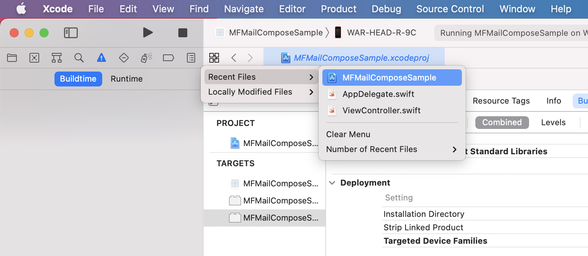

## iOS アプリ開発

### アプリ認証設定

- 設定
  - [Packaging] -> [Product Bundle Identifier] を変更
  - [Signing] -> [Development Team] を変更
- 参考 URL
  - [teratrail: Xcodeで作ったアプリを実機に入れる際のエラー](https://teratail.com/questions/51057)
  - [StackExchange: Xcode Build Error: No account for team “S23Q9DM44M”](https://bit.ly/3hnulr5)